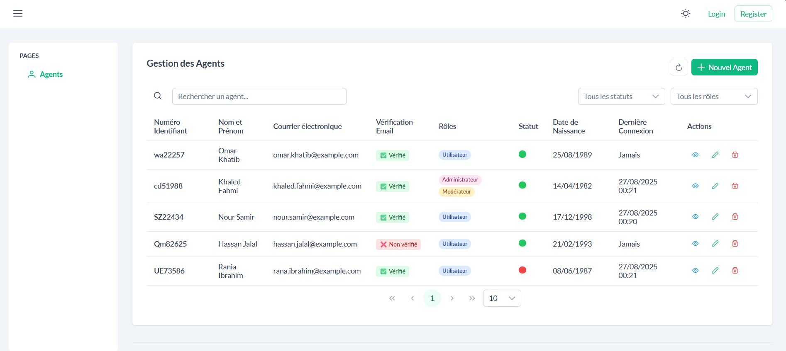

# Agent Management Application - Documentation

## Template

- **Templates PrimeNG** : Bibliothèque de composants UI pour Angular (version 20) - [Sakai Template](https://sakai.primeng.org/)
- **Tailwind CSS**

## Fonctionnalités Principales

- **Gestion des Agents** : Créer, lire, mettre à jour et supprimer des agents
- **Recherche** : Rechercher par nom ou email
- **Filtrage** : Filtrer par statut (actif/inactif) et rôles (Administrateur, Modérateur, Utilisateur)

## Démonstration Vidéo

- Démonstration de l'application :



[Télécharger la vidéo démo](image/video_demo.mp4)

## Structure du Projet (Fichiers Principaux)

```
agent-management-system/
├── src/
│   ├── app/
│   │   ├── pages/
│   │   │   └── agents/
│   │   │       ├── agents.component.ts
│   │   │       ├── agents.component.html
│   │   │       └── agents.component.scss
│   │   ├── models/
│   │   │   └── Agent.ts
│   │   ├── services/
│   │   │   └── AgentService.ts
│   │   └── app.module.ts
```
